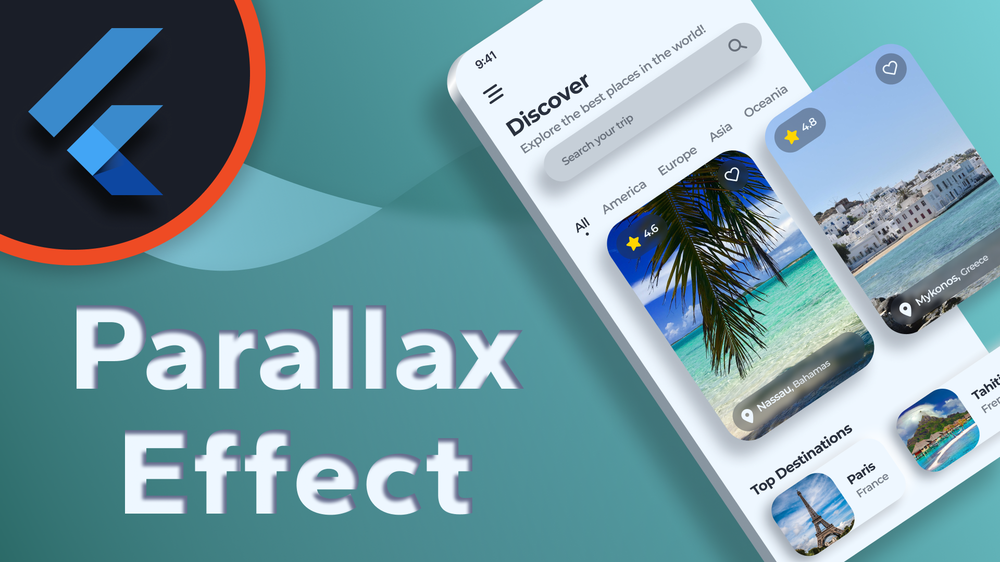

# Travel App UI

In this part, we will design a travel app UI with a parallax effect for a unique scroll experience. You will learn how to create your own parallax effect without using external libraries.

---

☕️ Creating these videos requires a lot of time and effort. If you enjoy my content you can buy me a coffee so I can produce more videos during the night:

[**Support DebugErrorX**](https://www.buymeacoffee.com/debugerrorx)

Thank you!

---

## [Watch it on YouTube](https://www.youtube.com/watch?v=JtKuY6wlYbw)

 

---

You want more Flutter content? Check out my YouTube channel [**DebugErrorX**](https://www.youtube.com/channel/UCtY6vtwLqivmnquY1fg-BkQ)
- [Recent Flutter Videos](https://www.youtube.com/channel/UCtY6vtwLqivmnquY1fg-BkQ/videos)
- [Subscribe to DebugErrorX](https://www.youtube.com/channel/UCtY6vtwLqivmnquY1fg-BkQ?sub_confirmation=1)